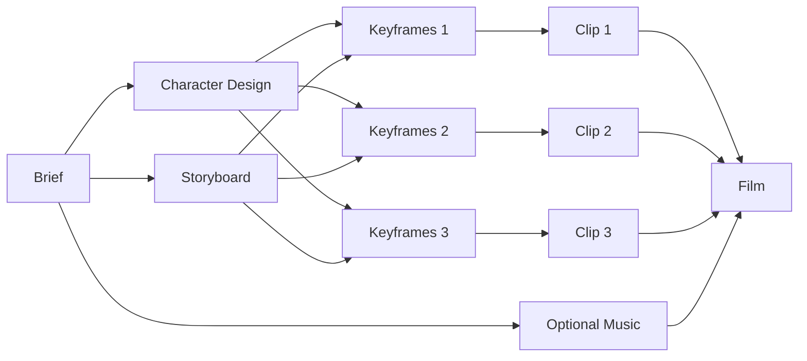

**JiuwenSwarm extension to support multi-modal creation/design scenarios and designer-users.**

Branch: `design` (~~based on `img-vid-gen-inline`~~ not any more. This branch also adds some AI provider support).

Operational pipeline notes (AI-first Play path): see also [`a.md`](./a.md) and [`designer_catalog_skills_reports_trajectory/`](./designer_catalog_skills_reports_trajectory/).

---

We curerntly focus on video design scenario. An example workflow:

- Each "connection" marks real data flow (left node used as an input to the right node). **Not simply execution order constraints**. (Real data flow indicates execution order but not the other way around)
- No need to pass Keyframe 1 as an input to Keyframe 2. Since there can be cutscenes, KF1 content is less informative/useful to KF2.
- If multiple nodes' dependency are all finished (e.g., all Keyframe X nodes), they can run together in parallel
- If node A & B run in parallel, A finishes first, and another node C only depends on A (but not B), C should be able to run after A finished and before B finishes.

---

## What changed vs the original `design` description

The original branch README (and the earlier Q&A snapshot) described a **handler-default** Play path: bootstrap stamped `delegate: "handler"`, per-node DeepAgents were off, and scheduling was a simple ready-wave over handlers.

**This working tree keeps that canvas / E2A foundation, and upgrades the runtime to an AI-first framework when a Settings chat model (e.g. DeepSeek) is available.** Heuristics remain only the no-LLM fallback.

### Scheduler (ready-queue, not column barriers)

| Topic | Original `design` (handler-centric) | Current framework |
|-------|--------------------------------------|-------------------|
| When a node starts | Ready when `data` / `sync` preds complete; wave-style launch | Same readiness rules, but a **continuous ready-queue**: as soon as any in-flight node finishes (`asyncio.wait(..., FIRST_COMPLETED)`), newly ready nodes are started |
| Wave barriers | Implicit “finish the wave” thinking in docs | **No wave barrier** between independent branches (e.g. Character ∥ Scene ∥ Music-from-Brief) |
| Concurrency | Task-per-ready-node | Cap **6** concurrent leaf tasks |
| Orchestration timing | Handlers only | Before the queue: **SupervisorAgent.plan** + **ManagerAgent.validate_plan**; optional one-shot post-keyframe clip adjust; end-of-run ratings |

Edges still gate **scheduling only** (not a payload bus). Handlers / agents still load artifacts by **role / shot_index** from `run.node_states[*].output_ref`.

### AI agents vs heuristics

| Piece | When `llm_available()` (DeepSeek / Settings chat model) | When no chat model |
|-------|----------------------------------------------------------|--------------------|
| Script / cast / shots | `analyze_creative_brief(use_llm=True)` → `source=llm` | Domain heuristics |
| Supervisor / Manager | `use_llm=True` via `model_tools.call_model_tool` | `plan_fast` / `validate_plan_fast` |
| Leaf creative nodes | `delegate=agent` → **NodeAgentHost** (openjiuwen DeepAgent + Designer tools) | `delegate=handler` |
| Music / Speech | Usually `force_handler` bed until TTS/music backends exist; omit if not requested | Same |
| Fallback honesty | Never label `[local-tool-fallback]` / schema-echo as `source=llm` | N/A |

Play stamps `metadata.ai_agent_pipeline` and `metadata.agent_runtime.mode` (`ai` | `heuristic`).

### Other framework additions (beyond original README)

- **Smart graph bootstrap** (`smart_graph.py`): prompt → cast/scenes/shots, solo character sheets, optional audio nodes, short-clip `target_shot_count=1` for ~6s prompts.
- **Identity + continuity**: costume locks, `identity_refs`, manager `CONTINUITY LOCK`, sequential keyframe edit when cameras compatible.
- **NodeAgentHost tools**: `designer_*` LocalFunctions accept flat `**kwargs` (openjiuwen style); `patch` may be object or JSON string.
- **Media materialization**: agents author specs; handlers materialize by **required family** (image vs video). A PNG must not count as a completed clip/compose.
- **Dotenv**: load `~/.jiuwenswarm/config/.env` before LLM calls so API keys are real.
- **Skills / catalog / trajectory / feedback** under `designer_catalog_skills_reports_trajectory/` and runtime helpers (`capabilities`, `continuity`, `paths`, `skills_loader`, …).
- **Eval harness**: `scripts/eval_6s_ai_clip.py` (refuses heuristic creative path when LLM is required).

Upstream `design` UI/handler improvements that landed on remote (storyboard table UX, graph restore after refresh, later-keyframe anti-clone policy in upstream handlers) are merged for the **frontend / compose** side where they did not conflict; **runtime executor + creative handlers + AI orchestration stay on this framework**.

## 本版已澄清的三个问题 / Three questions clarified (updated)

下面按**当前实现**写实。画布连线在代码里叫 `edges`，产品里常叫 trajectory.

---

### 1. Graph 中的 trajectory 是否具有输入 / 输出含义？

### 1. Do graph trajectories carry input / output meaning?

**有调度含义，没有通用的“沿边传物料”语义。** Trajectories gate scheduling; they are not a generic payload bus.

- Each edge is `source → target` with kinds:
  - `data`: target waits until every data predecessor (and that predecessor’s `sync` group) is completed.
  - `sync`: barrier, not payload (e.g. Character ↔ Storyboard Align).
- Actual inputs are loaded by **role / shot_index** from `run.node_states[*].output_ref`, not by walking edge payloads.
- `config.inputs` is kept aligned with `data` edges at bootstrap/expand; handlers still resolve by role at execute time.
- Scheduler: continuous ready-queue + concurrency cap (see above). Independent clips can still start when **their** keyframe finishes.

---

### 2. E2A 协议的调用和监听逻辑？

### 2. How does the E2A protocol call and listen?

Unchanged in spirit from the original `design` docs: E2A is the **Gateway ↔ AgentServer** envelope, not node-to-node sync.

**Call:** Browser `webRequest('designer.graph.*' | 'designer.run.*')` → Gateway → unary E2A → `DesignerAdapter` → GraphStore / GraphExecutor → response.

**Listen:** `designer.run.start` returns a snapshot; progress is push:

`designer.run.updated` / `designer.node.updated` / `designer.graph.updated`

Specs: `docs/zh/E2A-protocol.md`, `docs/en/E2A-protocol.md`. Designer A2A collab bus and inbound chat A2A channels are **not** this E2A envelope.

---

### 3. 当前节点的 Agent 是否实际参与作用？作用机制如何？

### 3. Does the per-node Agent actually participate, and how?

**Updated answer (this is the important delta vs the original README):**

**When Settings has a chat model (`llm_available() == True`), Play is AI-first: leaf DeepAgents do run. Heuristics / handler-only mode is for when no chat model is configured.**

Three layers:

1. **Scheduling** — `_execute_wave_run` ready-queue (`FIRST_COMPLETED`, max 6). Bootstrap uses `_prefer_runtime_pipeline` / `apply_runtime_delegate` (agents when LLM exists; handlers otherwise). `force_handler` keeps music/speech on fast beds.
2. **Orchestration agents** — `SupervisorAgent` / `ManagerAgent` via `call_model_tool` (+ skills). Script analysis prefers LLM JSON; rejects local-tool-fallback echoes.
3. **Leaf NodeAgentHost** — DeepAgent with `designer_graph_get` / `patch` / `node_run` / `node_complete`; on failure or missing required media family, **handler materialization** (image / I2V / compose) runs. Music/Speech without backends stay handlers.

Original README stated DeepAgents were off by default — that described the early handler prototype. **Do not treat that as current Play behavior when DeepSeek (or any Settings chat model) is configured.**

---

## Architecture notes (unchanged intent)

Implementation is in-tree (not a separate plugin) for now: frontend under `channels/web/frontend` Designer features; shell/orchestration under `server/runtime/designer` + gateway adapter.

Domain graph truth: `jiuwenswarm/common/schema/designer_graph.py`. Run state in designer runtime store. React Flow is a view projection.

Further pipeline detail: [`a.md`](./a.md) (short) and [`DETAIL.md`](./DETAIL.md) (full quality.v4 reproduction).

---

## Local browser test (before push)

1. Configure chat model + keys in `~/.jiuwenswarm/config/.env` / Settings (`API_KEY`, `API_BASE`, e.g. DeepSeek).
2. `jiuwenswarm-start all` (conda env `new` recommended).
3. Open the web UI (typically http://localhost:5173 or the printed web port).
4. Designer → prompt → Play; confirm run metadata `agent_runtime.mode=ai` / `script_analysis_mode=llm` and creative nodes `delegate=agent`.

Do **not** push until you are satisfied with the browser pass.
